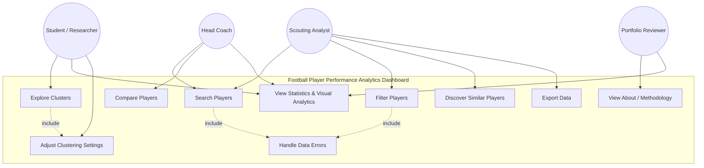

# Software Requirements Document (SRD)
## Football Player Performance Analytics Dashboard

---

## 1. Document Control

| Field | Value |
|---|---|
| Document Title | Software Requirements Document — Football Player Performance Analytics Dashboard |
| Document Type | Software Requirements Specification (SRS/SRD) |
| Project Name | Football Player Performance Analytics Dashboard |
| Prepared By | Software Architecture & Product Management Office, Pitchline Analytics Inc. |
| Document Owner | Senior Software Architect / Technical Lead |
| Version | 1.0 |
| Status | Approved for Development |
| Classification | Internal / Portfolio-Public |
| Date Created | 11 July 2026 |
| Last Updated | 11 July 2026 |
| Review Cycle | Reviewed at each sprint boundary and prior to major releases |

### 1.1 Revision History

| Version | Date | Author | Description |
|---|---|---|---|
| 0.1 | 20 June 2026 | Product Management Office | Initial draft — scope and objectives |
| 0.5 | 01 July 2026 | Technical Lead | Added functional/non-functional requirements |
| 0.8 | 08 July 2026 | Software Architect | Added use cases, diagrams, acceptance criteria |
| 1.0 | 11 July 2026 | Senior Software Architect | Baseline release for development sign-off |

### 1.2 Approval

| Role | Name / Function | Approval Status |
|---|---|---|
| Product Owner | Product Management Office | Approved |
| Technical Lead | Engineering | Approved |
| QA Lead | Quality Assurance | Approved |
| Data Science Lead | Analytics & ML | Approved |

---

## 2. Introduction

The **Football Player Performance Analytics Dashboard** ("the System") is a data-driven, interactive web application that enables analysts, scouts, coaches, and football enthusiasts to explore professional football player performance using statistical and machine-learning techniques. The System ingests Transfermarkt-derived datasets sourced from Kaggle, applies a reproducible data-preparation pipeline, engineers performance-oriented features, and applies unsupervised clustering (K-Means) to group players into data-driven "playing style" archetypes. Results are surfaced through a Streamlit-based dashboard offering search, filtering, comparison, and visual analytics capabilities.

This document defines the functional and non-functional requirements, target users, business objectives, use cases, and acceptance criteria that govern the design, implementation, and validation of the System. It is written to the standard of a formal Software Requirements Specification (per IEEE 830 / ISO/IEC/IEEE 29148 conventions) and is intended for engineering, QA, product, and academic review audiences.

### 2.1 Document Conventions

- Requirement identifiers follow the pattern `FR-##` (Functional Requirement) and `NFR-##` (Non-Functional Requirement).
- Priorities follow the **MoSCoW** method: **M**ust have, **S**hould have, **C**ould have, **W**on't have (this release).
- The keywords "shall," "should," and "may" are used per RFC 2119 convention: *shall* denotes a mandatory requirement, *should* a recommended requirement, and *may* an optional capability.

---

## 3. Purpose

The purpose of this document is to:

1. Define a complete, unambiguous, and verifiable set of functional and non-functional requirements for the Football Player Performance Analytics Dashboard.
2. Establish a shared contract between product stakeholders, engineering, data science, and quality assurance regarding what the System will and will not do.
3. Provide a traceable baseline against which acceptance testing, sprint planning, and future enhancement decisions can be measured.
4. Serve as a reference artifact suitable for academic capstone evaluation, portfolio presentation, and professional software engineering review.

---

## 4. Scope

### 4.1 In Scope

- Ingesting one or more Transfermarkt-based Kaggle CSV datasets containing player biographical, market-value, and performance attributes.
- Cleaning, validating, and transforming raw data into an analysis-ready format.
- Engineering derived performance features (per-90 statistics, efficiency ratios, composite indices).
- Standardizing features and applying K-Means clustering to identify player archetypes.
- Providing an interactive Streamlit dashboard with multiple pages: Home, Player Explorer, Cluster Explorer, Statistics, Visual Analytics, Data Download, About, and Settings.
- Enabling player search, multi-criteria filtering, side-by-side comparison, and similar-player discovery.
- Enabling export of filtered datasets and generated visualizations.
- Providing clear error handling and user feedback for invalid inputs, missing data, or pipeline failures.

### 4.2 Out of Scope

- Live/real-time match data ingestion (e.g., in-play statistics, video analysis).
- Predictive modeling of future transfer fees or match outcomes (reserved for future enhancement).
- User authentication, multi-tenant account management, or payment processing.
- Mobile native applications (iOS/Android); the System targets responsive web only.
- Direct write-back or editing of source datasets by end users.

---

## 5. Business Objectives

| ID | Objective | Business Value |
|---|---|---|
| BO-1 | Provide an objective, statistically grounded alternative to subjective player scouting narratives | Improves decision quality for scouting/analytics use cases |
| BO-2 | Demonstrate an end-to-end analytics + ML product suitable for portfolio and academic evaluation | Showcases software engineering, data science, and UX competency |
| BO-3 | Reduce time-to-insight when comparing players across statistical dimensions | Cuts manual spreadsheet analysis time |
| BO-4 | Establish a reusable, extensible analytics platform architecture | Enables future extension (predictive models, live data, new leagues) |
| BO-5 | Deliver a maintainable, well-documented, testable codebase | Reduces long-term maintenance cost and onboarding time |

---

## 6. Product Overview

The System is composed of three logical layers:

1. **Data Layer** — responsible for dataset acquisition, cleaning, validation, and feature engineering, producing a canonical analysis-ready dataset.
2. **Analytics/ML Layer** — responsible for feature scaling, K-Means clustering, cluster evaluation (Elbow Method, Silhouette Score), and derivation of player archetypes.
3. **Presentation Layer** — a Streamlit multi-page dashboard that exposes the processed data and cluster results through interactive visual components (tables, scatter plots, radar charts, heatmaps, KPIs).

The product is delivered as a Python application, runnable locally or deployed to a cloud host (e.g., Streamlit Community Cloud, a containerized service, or an internal PaaS), with a batch-oriented data-processing pipeline that can be re-run when the underlying dataset is refreshed.

---

## 7. Intended Users

| User Group | Description |
|---|---|
| Football Analysts | Professionals who evaluate player performance for clubs, agencies, or media outlets |
| Scouts | Individuals identifying transfer targets or replacements based on statistical archetypes |
| Coaches / Technical Staff | Staff assessing tactical fit of players within a squad |
| Students / Researchers | Academic users studying sports analytics, data science, or ML techniques |
| Football Enthusiasts | General users interested in exploring player statistics for personal interest |
| Portfolio Reviewers | Recruiters, professors, or technical evaluators assessing the project as a work sample |

---

## 8. Stakeholders

| Stakeholder | Interest |
|---|---|
| Product Owner | Ensures the System meets user needs and business objectives |
| Technical Lead / Architect | Ensures technical feasibility, architecture quality, and delivery timeline |
| Data Science Team | Owns feature engineering and clustering methodology correctness |
| QA / Test Engineering | Ensures requirements are verifiable and defects are minimized |
| End Users (analysts, scouts, students) | Primary consumers of dashboard insights |
| Academic Evaluators | Assess the project against capstone/portfolio rubrics |

---

## 9. User Personas

### 9.1 Persona: "Elena the Scouting Analyst"
- **Role:** Data analyst at a mid-tier football club
- **Goals:** Quickly identify undervalued players matching a specific playing style
- **Pain Points:** Manually cross-referencing spreadsheets is slow and error-prone
- **Needs from the System:** Fast filtering, cluster-based archetype discovery, exportable shortlist

### 9.2 Persona: "Marcus the Head Coach"
- **Role:** Technical staff evaluating tactical fit
- **Goals:** Compare a current squad player against potential signings using visual profiles
- **Pain Points:** Prefers visual summaries (radar charts) over raw statistical tables
- **Needs from the System:** Radar chart comparisons, intuitive navigation, minimal technical jargon

### 9.3 Persona: "Priya the Graduate Student"
- **Role:** Master's student researching sports analytics
- **Goals:** Understand how clustering algorithms group players and validate methodology
- **Pain Points:** Needs transparency into how clusters are formed (feature list, K selection rationale)
- **Needs from the System:** Cluster explorer with feature contribution details, downloadable data

### 9.4 Persona: "Devon the Portfolio Reviewer"
- **Role:** Technical recruiter / professor
- **Goals:** Assess code quality, architecture, and documentation rigor
- **Pain Points:** Limited time to review; needs clear documentation and demoable UI
- **Needs from the System:** Clean UI, About page describing methodology, well-organized repository

---

## 10. Functional Requirements

| ID | Requirement | Priority (MoSCoW) |
|---|---|---|
| FR-01 | The System shall load one or more Transfermarkt-based Kaggle CSV datasets from a configured local or remote path. | Must |
| FR-02 | The System shall validate dataset schema (required columns, data types) upon load and report validation errors. | Must |
| FR-03 | The System shall clean raw data by handling missing values, duplicate records, and inconsistent categorical labels (e.g., position naming, nationality naming). | Must |
| FR-04 | The System shall engineer derived features, including per-90-minute normalized statistics, efficiency ratios (e.g., goals per shot), and composite performance indices. | Must |
| FR-05 | The System shall standardize numerical features (zero mean, unit variance) prior to clustering. | Must |
| FR-06 | The System shall apply K-Means clustering to group players into a configurable number of clusters (K). | Must |
| FR-07 | The System shall support determination of an optimal K using the Elbow Method and Silhouette Score, with results visualized for the user. | Should |
| FR-08 | The System shall label each cluster with a human-interpretable archetype name derived from dominant feature characteristics. | Should |
| FR-09 | The System shall provide a text-based player search with autocomplete/suggestion behavior. | Must |
| FR-10 | The System shall allow filtering of players by league, club, nationality, position, age range, market value range, and cluster/archetype. | Must |
| FR-11 | The System shall display a sortable, paginated data table of filtered player results. | Must |
| FR-12 | The System shall allow users to select two or more players for side-by-side statistical comparison. | Should |
| FR-13 | The System shall recommend statistically similar players to a selected player based on feature-space distance within the same cluster. | Should |
| FR-14 | The System shall render cluster visualizations, including 2D scatter plots (with optional PCA-based dimensionality reduction) colored by cluster/archetype. | Must |
| FR-15 | The System shall render radar (spider) charts comparing selected players across key performance dimensions. | Must |
| FR-16 | The System shall render statistical distribution visualizations (histograms, box plots) for selected metrics. | Should |
| FR-17 | The System shall render a correlation heatmap of selected numerical features. | Could |
| FR-18 | The System shall display summary KPIs (e.g., total players analyzed, number of clusters, dataset last-updated date) on the dashboard home page. | Should |
| FR-19 | The System shall allow users to export the currently filtered dataset as CSV. | Must |
| FR-20 | The System shall allow users to export generated charts as PNG images. | Could |
| FR-21 | The System shall display clear, user-friendly error messages when data loading, filtering, or clustering operations fail. | Must |
| FR-22 | The System shall provide an About page describing data sources, methodology, and limitations. | Should |
| FR-23 | The System shall provide a Settings page allowing users to adjust clustering parameters (e.g., K) and reprocess results within the session. | Could |
| FR-24 | The System shall cache expensive computations (data loading, clustering) to avoid redundant recomputation within a session. | Should |
| FR-25 | The System shall persist no personally identifiable information about end users, as the System does not implement authentication. | Must |

---

## 11. Non-Functional Requirements

| ID | Category | Requirement | Priority |
|---|---|---|---|
| NFR-01 | Performance | The System shall render the initial dashboard view within 3 seconds for a dataset of up to 30,000 player records on standard cloud hosting. | Must |
| NFR-02 | Performance | Filtering and search operations shall return results within 1 second for the target dataset size. | Must |
| NFR-03 | Performance | Clustering recomputation (when parameters change) shall complete within 10 seconds for the target dataset size. | Should |
| NFR-04 | Reliability | The System shall handle malformed or missing dataset rows without crashing, degrading gracefully with logged warnings. | Must |
| NFR-05 | Reliability | The System shall maintain a 99% successful session rate (sessions completing without unhandled exceptions) during normal operation. | Should |
| NFR-06 | Security | The System shall not execute arbitrary user-supplied code or queries against the dataset. | Must |
| NFR-07 | Security | File exports shall be sanitized to prevent injection into downstream spreadsheet applications (e.g., CSV formula injection). | Should |
| NFR-08 | Scalability | The architecture shall support scaling the underlying dataset to multiple leagues/seasons without structural redesign. | Should |
| NFR-09 | Maintainability | The codebase shall be organized into clearly separated modules (data, features, ML, visualization, presentation) with unit test coverage of at least 70% for non-UI modules. | Must |
| NFR-10 | Maintainability | All public functions shall include docstrings following a consistent style (Google or NumPy docstring convention). | Should |
| NFR-11 | Availability | The deployed dashboard shall target 99.0% uptime during business hours, excluding scheduled maintenance. | Should |
| NFR-12 | Usability | The dashboard shall be navigable by a first-time user completing a core task (search + compare two players) within 3 minutes without external instructions. | Should |
| NFR-13 | Accessibility | The dashboard shall maintain a minimum color contrast ratio of 4.5:1 for text elements and provide descriptive labels for interactive widgets. | Should |
| NFR-14 | Responsiveness | The dashboard layout shall adapt to desktop, tablet, and mobile-width viewports without loss of core functionality. | Could |
| NFR-15 | Portability | The System shall run identically on Windows, macOS, and Linux environments supporting Python 3.10+. | Must |
| NFR-16 | Observability | The System shall log key pipeline events (data load, cleaning summary, clustering run) at INFO level and errors at ERROR level. | Should |

---

## 12. User Stories

| ID | As a... | I want to... | So that... | Priority |
|---|---|---|---|---|
| US-01 | Scouting analyst | search for a player by name | I can quickly view their profile and statistics | Must |
| US-02 | Scouting analyst | filter players by position and age range | I can shortlist candidates matching a role | Must |
| US-03 | Head coach | compare two players on a radar chart | I can visually assess tactical fit | Must |
| US-04 | Graduate student | view which features most influence a cluster | I can validate the clustering methodology | Should |
| US-05 | Scout | find players statistically similar to a target player | I can identify alternative transfer targets | Should |
| US-06 | Any user | export filtered player data to CSV | I can continue analysis in Excel/other tools | Must |
| US-07 | Any user | see an explanation of the data source and methodology | I can trust the insights presented | Should |
| US-08 | Portfolio reviewer | read an About page summarizing the project | I can quickly assess the project's technical depth | Should |
| US-09 | Any user | see a clear error message if data fails to load | I understand what went wrong and what to do next | Must |
| US-10 | Analyst | adjust the number of clusters (K) | I can explore alternative groupings of player archetypes | Could |

---

## 13. Acceptance Criteria

| Story ID | Acceptance Criteria |
|---|---|
| US-01 | Given a valid player name substring, when the user submits a search, then matching players are displayed within 1 second, and an empty result shows a "no players found" message rather than an error. |
| US-02 | Given filter selections (position, age range), when applied, then only players satisfying all active filters are shown in the results table, and the result count updates in the UI. |
| US-03 | Given two selected players, when the user opens the comparison view, then a radar chart displays both players' normalized values across at least 6 shared metrics. |
| US-04 | Given a selected cluster, when the user opens the Cluster Explorer, then the top contributing features and their relative weights/averages are displayed. |
| US-05 | Given a selected player, when the user requests similar players, then at least 5 statistically nearest players (by Euclidean distance in standardized feature space) within the same cluster are returned, ranked by similarity. |
| US-06 | Given an active filter set, when the user clicks "Export CSV," then a CSV file containing exactly the filtered rows and selected columns is downloaded. |
| US-07 | Given the About page is opened, then it displays dataset source, last updated date, clustering methodology summary, and known limitations. |
| US-09 | Given a dataset load failure (e.g., missing file, malformed CSV), when the dashboard starts, then a descriptive error banner is shown instead of a raw stack trace, with a suggested remediation step. |

---

## 14. Use Case Diagram

---

## 15. Detailed Use Cases

### UC-01: Search Players

| Field | Description |
|---|---|
| Use Case ID | UC-01 |
| Name | Search Players |
| Actor(s) | Scouting Analyst, Head Coach, any authenticated-free user |
| Preconditions | Player dataset has been successfully loaded and processed |
| Trigger | User types a query into the search bar on the Player Explorer page |
| Main Flow | 1. User navigates to Player Explorer. 2. User enters a partial or full player name. 3. System filters the in-memory dataset for name matches (case-insensitive substring match). 4. System displays matching players in a results table with key attributes (name, club, position, age, market value). 5. User selects a player to view the detailed profile. |
| Alternate Flow | 3a. If no matches are found, System displays a "no players found" message and suggests checking spelling. |
| Postconditions | Selected player's detailed profile is available for further actions (comparison, similarity search). |
| Exceptions | If the dataset fails to load prior to search, System displays an error state instead of the search bar. |

### UC-02: Filter Players by Criteria

| Field | Description |
|---|---|
| Use Case ID | UC-02 |
| Name | Filter Players by Criteria |
| Actor(s) | Scouting Analyst |
| Preconditions | Dataset loaded; sidebar filters rendered |
| Trigger | User adjusts one or more sidebar filter widgets (league, position, age range, market value range, cluster) |
| Main Flow | 1. User opens sidebar filters. 2. User selects/adjusts one or more filter criteria. 3. System applies all active filters as a combined (logical AND) query against the dataset. 4. System updates the results table and result count in real time. |
| Alternate Flow | 3a. If the combined filters yield zero results, System displays a message indicating no players match and suggests relaxing filters. |
| Postconditions | Filtered result set becomes the active context for export, comparison, and visualization actions. |

### UC-03: Compare Players

| Field | Description |
|---|---|
| Use Case ID | UC-03 |
| Name | Compare Players |
| Actor(s) | Head Coach, Scouting Analyst |
| Preconditions | At least two players selected from search or filtered results |
| Trigger | User clicks "Compare Selected Players" |
| Main Flow | 1. User selects two or more players via checkboxes in the results table. 2. User navigates to the comparison view. 3. System normalizes selected metrics to a common 0–100 scale. 4. System renders a radar chart and a side-by-side statistics table. |
| Alternate Flow | 1a. If fewer than two players are selected, System disables the "Compare" action and displays a hint. |
| Postconditions | Comparison view remains available until selection is cleared or changed. |

### UC-04: Explore Clusters

| Field | Description |
|---|---|
| Use Case ID | UC-04 |
| Name | Explore Player Clusters |
| Actor(s) | Graduate Student, Scouting Analyst |
| Preconditions | Clustering pipeline has completed successfully and cluster labels are attached to the dataset |
| Trigger | User navigates to the Cluster Explorer page |
| Main Flow | 1. System displays a 2D projection (PCA) scatter plot of all players, colored by cluster. 2. User selects a cluster (via legend click or dropdown). 3. System filters the view to the selected cluster and displays representative players, dominant features, and archetype label. |
| Alternate Flow | 2a. User may adjust K (number of clusters) if Settings permit, triggering re-clustering. |
| Postconditions | Selected cluster context can feed into similarity search or export. |

### UC-05: Discover Similar Players

| Field | Description |
|---|---|
| Use Case ID | UC-05 |
| Name | Discover Similar Players |
| Actor(s) | Scouting Analyst |
| Preconditions | A target player is selected; clustering and feature scaling completed |
| Trigger | User clicks "Find Similar Players" on a player profile |
| Main Flow | 1. System computes Euclidean distance between the target player's standardized feature vector and all other players (optionally restricted to the same cluster). 2. System ranks candidates by ascending distance. 3. System displays the top N (default 5) most similar players with similarity scores. |
| Postconditions | User may add similar players to a comparison or export list. |

---

## 16. System Constraints

| Constraint | Description |
|---|---|
| C-01 | The System depends on the availability and schema stability of the Transfermarkt-based Kaggle dataset; schema changes require pipeline updates. |
| C-02 | Streamlit's single-threaded execution model constrains concurrent heavy computation; expensive operations must be cached. |
| C-03 | The System operates on a static, periodically refreshed dataset rather than real-time data feeds. |
| C-04 | Clustering is unsupervised; cluster labels are algorithmically derived and require human-readable interpretation, introducing a degree of subjectivity in archetype naming. |
| C-05 | The System must run within typical free/low-tier cloud hosting memory limits (e.g., ~1 GB RAM on Streamlit Community Cloud) for the default deployment target. |

---

## 17. Assumptions

- The Kaggle Transfermarkt dataset is reasonably complete and updated on a periodic (not real-time) basis.
- Users have basic familiarity with football terminology (positions, metrics such as xG, market value).
- The dataset size remains within a range (tens of thousands of rows) suitable for in-memory processing with Pandas.
- End users access the dashboard via modern browsers (Chrome, Firefox, Edge, Safari, current or one prior major version).
- No formal user authentication is required for the initial release.

---

## 18. Dependencies

| Dependency | Type | Notes |
|---|---|---|
| Transfermarkt Kaggle Dataset | External Data | Subject to Kaggle's terms of use and dataset maintainer update cadence |
| Python 3.10+ runtime | Technical | Required for type-hinting and library compatibility |
| Pandas, NumPy | Library | Core data manipulation |
| Scikit-learn | Library | K-Means clustering, StandardScaler, PCA, silhouette scoring |
| Plotly, Matplotlib, Seaborn | Library | Visualization rendering |
| Streamlit | Library/Framework | Dashboard presentation layer |
| Hosting Platform (e.g., Streamlit Community Cloud, Docker host) | Infrastructure | Deployment target |

---

## 19. Risks

| ID | Risk | Likelihood | Impact | Mitigation |
|---|---|---|---|---|
| R-01 | Source dataset contains significant missing or inconsistent data | Medium | High | Robust cleaning pipeline; explicit missing-value strategy; validation reporting |
| R-02 | Clustering results are not intuitively interpretable by non-technical users | Medium | Medium | Archetype labeling heuristics; feature-contribution explanations in Cluster Explorer |
| R-03 | Performance degradation with larger datasets (multiple leagues/seasons) | Medium | Medium | Caching, vectorized operations, optional data sampling for visualization |
| R-04 | Kaggle dataset licensing/availability changes | Low | High | Document data provenance; support pluggable dataset source configuration |
| R-05 | Streamlit hosting resource limits cause slow load or crashes | Medium | Medium | Data caching (`st.cache_data`), lazy loading, optional containerized deployment |
| R-06 | Misinterpretation of statistical clusters as definitive player quality rankings | Medium | Medium | Clear disclaimers on About page; framing as "playing style" not "quality" |

---

## 20. Success Metrics

| Metric | Target |
|---|---|
| Dashboard initial load time | ≤ 3 seconds for target dataset size |
| Search/filter response time | ≤ 1 second |
| Successful session completion rate | ≥ 99% |
| Unit test coverage (non-UI modules) | ≥ 70% |
| User task completion (search + compare) without instructions | ≥ 90% of test users within 3 minutes |
| Cluster silhouette score (quality indicator) | ≥ 0.25 (acceptable separation for real-world sports data) |
| Academic/portfolio review rating | Meets or exceeds capstone rubric criteria for architecture, documentation, and functionality |

---

## 21. Future Enhancements

- Predictive modeling (e.g., market value forecasting, injury-risk indicators) using supervised learning.
- Integration of live/near-real-time match statistics APIs.
- Multi-season trend analysis and player development trajectories.
- User accounts with saved filters, watchlists, and shortlists.
- Advanced clustering techniques (e.g., Gaussian Mixture Models, hierarchical clustering) as alternative or complementary methods to K-Means.
- Natural-language query interface ("show me young left-backs under €10M with high pace") powered by an LLM layer.
- Automated report generation (PDF scouting reports) per player or shortlist.

---

*End of Software Requirements Document.*
