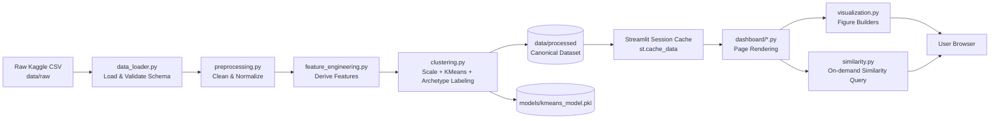

# Technical Requirements Document (TRD)
## Football Player Performance Analytics Dashboard

---

## Document Control

| Field | Value |
|---|---|
| Document Title | Technical Requirements Document — Football Player Performance Analytics Dashboard |
| Version | 1.0 |
| Status | Approved for Development |
| Prepared By | Engineering & Data Science, Pitchline Analytics Inc. |
| Date | 11 July 2026 |
| Companion Documents | Software Requirements Document (SRD) v1.0, Software Architecture Document (SAD) v1.0 |

---

## Executive Summary

This Technical Requirements Document (TRD) translates the functional and non-functional requirements defined in the SRD into concrete technical specifications: technology choices, module boundaries, data pipelines, machine learning methodology, and operational concerns (logging, testing, deployment, security). It is intended for software engineers, data scientists, and technical reviewers who will implement, extend, or evaluate the System.

---

## 1. Technical Overview

The Football Player Performance Analytics Dashboard is implemented as a modular Python application composed of a batch data-processing pipeline (extract → clean → engineer features → scale → cluster) and a Streamlit-based presentation layer that consumes the processed dataset. The pipeline is designed to run either as a pre-processing step (producing a cached, versioned dataset artifact) or on-demand within the Streamlit session using caching decorators to avoid redundant computation.

The application follows a **layered architecture** (data, domain/analytics, presentation) with clear module boundaries, enabling independent testing of the data and ML logic without invoking the Streamlit UI.

---

## 2. Technology Stack

| Layer | Technology | Purpose |
|---|---|---|
| Language Runtime | Python 3.10+ | Primary implementation language |
| Data Manipulation | Pandas, NumPy | Loading, cleaning, transforming tabular data |
| Machine Learning | Scikit-learn | StandardScaler, KMeans, PCA, silhouette_score |
| Visualization (interactive) | Plotly | Scatter plots, radar charts, interactive KPIs |
| Visualization (static) | Matplotlib, Seaborn | Heatmaps, distribution plots, elbow/silhouette charts |
| Presentation / Dashboard | Streamlit | Multi-page interactive web application |
| Testing | Pytest | Unit and integration testing |
| Linting/Formatting | Ruff / Black / isort | Code quality and style enforcement |
| Dependency Management | pip + `requirements.txt` (or Poetry) | Reproducible environment |
| Version Control | Git / GitHub | Source control and collaboration |
| CI | GitHub Actions | Automated linting, testing on push/PR |
| Deployment Target | Streamlit Community Cloud / Docker container | Hosting |

---

## 3. Development Environment

| Requirement | Specification |
|---|---|
| Python Version | 3.10 or later |
| Package Manager | pip (with `venv`) or Poetry |
| Recommended IDE | VS Code / PyCharm with Python & Jupyter extensions |
| OS Support | Windows 10+, macOS 12+, Ubuntu 20.04+ |
| Minimum RAM (dev) | 8 GB (16 GB recommended for full dataset exploration in notebooks) |
| Local Dev Server | `streamlit run app.py` on port 8501 |
| Environment Variables | `DATA_PATH`, `LOG_LEVEL`, `DEFAULT_K` (see Configuration Management, Section 15) |

### 3.1 Setup Procedure

```bash
git clone https://github.com/pitchline-analytics/football-dashboard.git
cd football-dashboard
python -m venv .venv
source .venv/bin/activate      # Windows: .venv\Scripts\activate
pip install -r requirements.txt
streamlit run app.py
```

---

## 4. Folder Structure

```
football-dashboard/
│
├── app.py                     # Streamlit entry point (page router)
├── requirements.txt           # Pinned dependency versions
├── pyproject.toml             # Tooling configuration (ruff/black/pytest)
├── README.md                  # Project overview, setup, usage
├── LICENSE
│
├── config/
│   └── settings.yaml          # Default configuration (paths, K, thresholds)
│
├── assets/
│   ├── logo.png
│   └── styles.css             # Custom Streamlit theming overrides
│
├── data/
│   ├── raw/                   # Unmodified source Kaggle CSV(s)
│   ├── interim/                # Intermediate cleaned data (not yet feature-engineered)
│   └── processed/              # Final analysis-ready + clustered dataset (parquet/csv)
│
├── models/
│   └── kmeans_model.pkl        # Serialized fitted clustering model + scaler
│
├── notebooks/
│   ├── 01_eda.ipynb             # Exploratory data analysis
│   ├── 02_feature_engineering.ipynb
│   └── 03_clustering_experiments.ipynb
│
├── src/
│   ├── __init__.py
│   ├── config.py               # Configuration loader
│   ├── data_loader.py          # Dataset ingestion
│   ├── preprocessing.py        # Cleaning & validation
│   ├── feature_engineering.py  # Derived feature computation
│   ├── clustering.py           # Scaling, KMeans, Elbow/Silhouette, archetype labeling
│   ├── similarity.py           # Nearest-neighbor similarity search
│   ├── visualization.py        # Plotly/Matplotlib/Seaborn chart builders
│   ├── dashboard/
│   │   ├── __init__.py
│   │   ├── home.py              # Home page rendering
│   │   ├── player_explorer.py   # Search/filter/profile page
│   │   ├── cluster_explorer.py  # Cluster visualization page
│   │   ├── statistics.py        # Statistics page
│   │   ├── visual_analytics.py  # Visual analytics page
│   │   ├── data_download.py     # Export page
│   │   ├── about.py             # About/methodology page
│   │   └── settings.py          # Settings page
│   └── utils.py                # Shared helpers (caching, formatting, logging setup)
│
├── tests/
│   ├── test_preprocessing.py
│   ├── test_feature_engineering.py
│   ├── test_clustering.py
│   ├── test_similarity.py
│   └── test_utils.py
│
├── docs/
│   ├── 01-Software-Requirements-Document.md
│   ├── 02-Technical-Requirements-Document.md
│   └── 03-Software-Architecture-Document.md
│
└── deployment/
    ├── Dockerfile
    ├── docker-compose.yml
    └── streamlit_config.toml
```

### 4.1 Folder Purpose Summary

| Folder | Purpose |
|---|---|
| `config/` | Centralized, environment-agnostic configuration (data paths, default K, thresholds) |
| `assets/` | Static UI assets (logo, custom CSS) |
| `data/raw` | Immutable source data as downloaded from Kaggle; never modified in place |
| `data/interim` | Post-cleaning, pre-feature-engineering checkpoint for debugging/reproducibility |
| `data/processed` | Final canonical dataset consumed by the dashboard, including cluster labels |
| `models/` | Serialized ML artifacts (scaler + KMeans model) for reproducible inference |
| `notebooks/` | Exploratory work; not part of the production import path |
| `src/` | Production application source code, organized by responsibility |
| `src/dashboard/` | Streamlit page modules, one per dashboard page |
| `tests/` | Automated test suite mirroring `src/` structure |
| `docs/` | Formal project documentation (this document set) |
| `deployment/` | Containerization and deployment configuration |

---

## 5. Module Breakdown

| Module | Responsibility |
|---|---|
| `config.py` | Load and expose typed configuration values from `config/settings.yaml` and environment variables |
| `data_loader.py` | Locate, read, and perform initial schema validation of source CSV data |
| `preprocessing.py` | Clean data: handle missing values, deduplicate, normalize categorical labels, enforce types |
| `feature_engineering.py` | Compute derived/engineered features (per-90 stats, ratios, composite indices) |
| `clustering.py` | Standardize features, fit/apply KMeans, compute Elbow/Silhouette diagnostics, assign archetype labels |
| `similarity.py` | Compute nearest-neighbor similarity between players in standardized feature space |
| `visualization.py` | Build reusable Plotly/Matplotlib/Seaborn figure objects consumed by dashboard pages |
| `utils.py` | Cross-cutting helpers: logging setup, Streamlit caching wrappers, formatting utilities, CSV export sanitization |
| `dashboard/*.py` | One module per Streamlit page; responsible only for UI composition and calling into `src/` business logic |
| `app.py` | Application entry point; configures page routing/navigation and global page settings |

---

## 6. Component Responsibilities

| Component | Inputs | Outputs | Key Responsibilities |
|---|---|---|---|
| Data Loader | Raw CSV path(s) | Raw `DataFrame` | File I/O, encoding handling, schema pre-check |
| Preprocessor | Raw `DataFrame` | Cleaned `DataFrame` | Missing value strategy, dedup, type coercion, categorical normalization |
| Feature Engineer | Cleaned `DataFrame` | Feature-enriched `DataFrame` | Derived metric computation, composite index construction |
| Clustering Engine | Feature-enriched `DataFrame` | Cluster-labeled `DataFrame`, fitted model artifacts | Scaling, KMeans fitting, K selection diagnostics, archetype labeling |
| Similarity Engine | Cluster-labeled `DataFrame`, target player ID | Ranked list of similar players | Distance computation, ranking |
| Visualization Builder | Any prepared `DataFrame`/subset | Plotly/Matplotlib figure objects | Chart construction, consistent styling |
| Dashboard Pages | User interaction events, prepared data | Rendered UI | Widget composition, state management, calling business-logic modules |
| App Router | N/A | Rendered page based on navigation | Page registration, sidebar navigation, global session state initialization |

---

## 7. Data Flow



---

## 8. Database / Data Storage Strategy

The System does not use a traditional relational or NoSQL database for its initial release. Instead, it adopts a **file-based, versioned dataset strategy**:

| Stage | Storage Format | Rationale |
|---|---|---|
| Raw | CSV (as downloaded from Kaggle) | Preserves original source fidelity |
| Interim | Parquet | Efficient columnar storage for intermediate checkpoints |
| Processed (canonical) | Parquet (CSV export available on demand) | Fast load times, type-preserving, compressed |
| ML Artifacts | Pickle / joblib (`.pkl`) | Standard Scikit-learn serialization format |

**Design Rationale:** Given the read-heavy, batch-oriented nature of the workload and the absence of concurrent multi-user writes, a file-based approach minimizes operational complexity while meeting performance targets. Should the System scale to require concurrent writes, multi-user watchlists, or transactional updates (see Future Enhancements in the SRD), migration to a managed relational database (e.g., PostgreSQL) or document store is the recommended evolution path, isolated behind a repository-pattern data-access interface to minimize refactor cost.

---

## 9. Data Processing Pipeline

The data processing pipeline executes as a sequential, idempotent batch job:

1. **Extraction** — `data_loader.py` reads the raw CSV(s), verifying presence of required columns (e.g., `player_name`, `club`, `position`, `age`, `market_value_eur`, performance statistics columns).
2. **Cleaning** — `preprocessing.py` applies:
   - Missing value imputation or row exclusion based on a documented per-column strategy (see Section 9.1).
   - Deduplication on `(player_name, club, season)` composite key.
   - Standardization of categorical values (e.g., unifying `"CB"`, `"Centre-Back"`, `"Centre Back"` into a single canonical label).
   - Type coercion (numeric columns cast to `float64`/`int64`, dates parsed to `datetime64`).
3. **Validation** — Post-cleaning assertions verify no residual nulls in required fields and that numeric ranges are plausible (e.g., age between 15–45, market value ≥ 0).
4. **Persistence** — Cleaned data is written to `data/interim/` for reproducibility and debugging.

### 9.1 Missing Value Handling Strategy

| Column Type | Strategy |
|---|---|
| Critical identifiers (name, club, position) | Row dropped if missing |
| Continuous performance metrics (goals, assists, minutes played) | Imputed with `0` where absence indicates "did not occur," or median imputation where absence indicates unknown/unmeasured |
| Market value | Median imputation grouped by position and age bracket, to preserve realistic distribution |
| Categorical (nationality, foot preference) | Imputed with mode or an explicit `"Unknown"` category |

---

## 10. Feature Engineering Pipeline

`feature_engineering.py` derives analysis-oriented features from raw counting statistics:

| Derived Feature | Formula | Purpose |
|---|---|---|
| Goals per 90 | `goals / minutes_played * 90` | Normalizes output across differing playing time |
| Assists per 90 | `assists / minutes_played * 90` | Normalizes creative output |
| Shot Conversion Rate | `goals / shots_total` | Measures finishing efficiency |
| Pass Completion Rate | `passes_completed / passes_attempted` | Measures distribution reliability |
| Duels Won Rate | `duels_won / duels_total` | Measures physical/defensive effectiveness |
| Market Value per Age-Adjusted Index | `market_value_eur / age_factor` | Normalizes valuation against typical age-value curve |
| Composite Offensive Index | Weighted sum of normalized goals, assists, shots, and key passes per 90 | Single-metric offensive contribution summary |
| Composite Defensive Index | Weighted sum of normalized tackles, interceptions, clearances, duels won per 90 | Single-metric defensive contribution summary |

All per-90 and ratio features guard against division-by-zero by substituting `NaN` (subsequently imputed) when the denominator is zero or the player has fewer than a configurable minimum-minutes threshold (default: 450 minutes), which also excludes small-sample statistical noise from clustering.

---

## 11. Machine Learning Pipeline

The ML pipeline (`clustering.py`) executes the following stages:

1. **Feature Selection** — A curated subset of engineered numeric features relevant to playing style (e.g., per-90 attacking, defensive, and passing metrics) is selected, explicitly excluding features that would leak identity or market bias (e.g., market value, wage) from the clustering feature set to keep clusters style-based rather than value-based.
2. **Feature Scaling** — `StandardScaler` transforms each feature to zero mean and unit variance:

   ```
   z = (x - μ) / σ
   ```

   where `x` is the raw feature value, `μ` is the feature mean, and `σ` is the feature standard deviation across the training population. Standardization is essential for K-Means because the algorithm relies on Euclidean distance, which is sensitive to feature scale.

3. **Dimensionality Consideration (Optional PCA)** — Principal Component Analysis may be applied for visualization purposes (reducing to 2 components for scatter plotting) but is **not** used to reduce dimensionality prior to clustering by default, in order to preserve interpretability of cluster centers in original feature terms. PCA-for-visualization is a separate, downstream step from PCA-for-modeling.
4. **Clustering** — `KMeans` (Scikit-learn) is fit on the standardized feature matrix.
5. **Model Persistence** — The fitted `StandardScaler` and `KMeans` model are serialized to `models/kmeans_model.pkl` for reproducible inference without re-fitting on every session.

---

## 12. K-Means Clustering Process

### 12.1 Algorithm Summary

K-Means partitions `n` observations into `k` clusters by minimizing within-cluster variance (inertia):

```
J = Σ(i=1 to k) Σ(x in Cᵢ) ||x - μᵢ||²
```

where `Cᵢ` is the set of points assigned to cluster `i` and `μᵢ` is the centroid of cluster `i`. The algorithm iterates:

1. Initialize `k` centroids (using `k-means++` initialization for improved convergence).
2. **Assignment step:** assign each point to the nearest centroid by Euclidean distance.
3. **Update step:** recompute each centroid as the mean of points assigned to it.
4. Repeat steps 2–3 until centroid movement falls below a tolerance threshold or a maximum iteration count is reached.

### 12.2 Choosing K — Elbow Method

The Elbow Method plots inertia (within-cluster sum of squares) against candidate values of `K` (typically 2–12). The "elbow" — the point at which additional clusters yield diminishing reduction in inertia — is selected as a candidate optimal `K`. This is rendered as an interactive line chart on the Settings/Cluster Explorer pages.

### 12.3 Choosing K — Silhouette Score

The Silhouette Score complements the Elbow Method by measuring how well-separated clusters are:

```
s(i) = (b(i) - a(i)) / max(a(i), b(i))
```

where `a(i)` is the mean intra-cluster distance for point `i`, and `b(i)` is the mean distance to the nearest neighboring cluster. Scores range from -1 to 1; values closer to 1 indicate well-separated, cohesive clusters. The System computes the mean Silhouette Score across candidate `K` values and surfaces both diagnostics side-by-side so users can make an informed choice rather than relying on a single heuristic.

### 12.4 Cluster Interpretation and Archetype Labeling

After fitting, each cluster's centroid (in original feature units, via inverse transform of the scaler) is analyzed to identify its top 3–5 dominant features relative to the population mean. A rules-based labeling heuristic maps dominant feature combinations to human-readable archetype names, for example:

| Dominant Features | Example Archetype Label |
|---|---|
| High goals/90, high shot conversion | "Clinical Finisher" |
| High key passes/90, high pass completion | "Creative Playmaker" |
| High tackles/90, high interceptions/90 | "Defensive Anchor" |
| High duels won, high aerial duels won | "Physical Presence" |
| Balanced offensive + defensive contribution | "Box-to-Box Contributor" |

Labels are configurable and stored in `config/settings.yaml` to allow refinement without code changes.

### 12.5 PCA for Visualization (Optional Enhancement)

For the Cluster Explorer scatter plot, PCA reduces the standardized feature matrix to 2 principal components:

```
Z = X · W
```

where `X` is the standardized feature matrix, and `W` contains the top 2 eigenvectors of the feature covariance matrix (ranked by explained variance). The percentage of variance explained by each component is displayed to the user as a transparency measure, since 2D projection necessarily loses information from higher-dimensional clustering.

---

## 13. Visualization Engine

`visualization.py` centralizes chart construction to ensure consistent styling and avoid duplicated logic across dashboard pages.

| Chart Type | Library | Used On |
|---|---|---|
| Scatter Plot (cluster projection) | Plotly | Cluster Explorer |
| Radar / Spider Chart | Plotly | Player Explorer (comparison) |
| Bar Chart (KPIs, top-N players) | Plotly | Home, Statistics |
| Histogram | Plotly / Seaborn | Statistics, Visual Analytics |
| Box Plot | Seaborn | Statistics, Visual Analytics |
| Correlation Heatmap | Seaborn / Matplotlib | Visual Analytics |
| Elbow / Silhouette Line Chart | Plotly | Settings, Cluster Explorer |

All chart-building functions accept a `DataFrame` and configuration parameters and return a figure object, keeping presentation modules thin (they call `visualization.py` and pass the result to `st.plotly_chart()` / `st.pyplot()`).

---

## 14. Streamlit Architecture

The dashboard uses Streamlit's **multi-page app** pattern, with `app.py` as the entry point configuring global page settings (`st.set_page_config`) and a sidebar navigation menu. Each page under `src/dashboard/` is a self-contained render function invoked by the router based on the active navigation selection.

**Session State Usage:** Streamlit's `st.session_state` maintains cross-interaction state within a user session, including:
- Currently active filters
- Selected players for comparison
- Current clustering parameters (K)
- Cached processed dataset reference

**Caching Strategy:** `st.cache_data` decorates data-loading and feature-engineering functions (pure, hashable-input functions returning serializable data); `st.cache_resource` decorates the fitted clustering model to avoid re-fitting on every rerun, since Streamlit re-executes the script top-to-bottom on each user interaction.

---

## 15. Configuration Management

Configuration is centralized in `config/settings.yaml` and loaded via `config.py`, with environment variable overrides for deployment flexibility (12-factor app principle).

| Key | Default | Override Env Var |
|---|---|---|
| `data.raw_path` | `data/raw/transfermarkt_players.csv` | `DATA_PATH` |
| `clustering.default_k` | 6 | `DEFAULT_K` |
| `clustering.min_minutes_threshold` | 450 | `MIN_MINUTES` |
| `logging.level` | `INFO` | `LOG_LEVEL` |
| `app.page_title` | "Football Player Performance Analytics Dashboard" | — |
| `app.cache_ttl_seconds` | 3600 | `CACHE_TTL` |

---

## 16. Logging Strategy

- Python's standard `logging` module is configured in `utils.py` with a consistent formatter (`timestamp | level | module | message`).
- **INFO** level logs key pipeline milestones: dataset load complete (row count), cleaning summary (rows dropped/imputed), clustering run complete (K, inertia, silhouette score).
- **WARNING** level logs recoverable data-quality issues (e.g., a row dropped due to missing critical fields).
- **ERROR** level logs pipeline failures (e.g., file not found, schema validation failure), always paired with a user-facing, non-technical error message in the UI.
- Logs are written to stdout (captured by the hosting platform) and optionally to a rotating file handler (`logs/app.log`) in local development.

---

## 17. Error Handling Strategy

| Failure Scenario | Handling Approach |
|---|---|
| Source CSV missing or unreadable | Caught at `data_loader.py`; user sees a friendly error banner with remediation guidance; full stack trace logged at ERROR level only |
| Schema validation failure (missing required column) | Raised as a custom `DataValidationError`; caught at the app-level boundary and rendered as a structured error message listing missing columns |
| Clustering failure (e.g., insufficient rows for requested K) | Caught in `clustering.py`; System falls back to the previous valid K or default K, with a warning displayed |
| Empty filter/search results | Not treated as an error; rendered as an informative empty state |
| Export failure (e.g., permissions, I/O error) | Caught at the export handler; user notified via toast/alert; operation retried is not automatic to avoid partial file corruption |

All custom exceptions inherit from a base `AppError` class defined in `utils.py`, enabling consistent catch-and-render handling at the Streamlit page boundary.

---

## 18. Testing Strategy

| Test Level | Scope | Tooling |
|---|---|---|
| Unit Tests | Individual functions in `preprocessing.py`, `feature_engineering.py`, `clustering.py`, `similarity.py`, `utils.py` | Pytest |
| Integration Tests | End-to-end pipeline: raw CSV fixture → cleaned → feature-engineered → clustered dataset | Pytest with sample fixture datasets |
| Regression Tests | Ensure archetype labeling and similarity ranking remain stable across refactors, using fixed random seeds | Pytest, `numpy.random.seed` fixtures |
| UI Smoke Tests | Verify Streamlit app starts without exceptions and core pages render | Streamlit `AppTest` framework |
| Coverage Target | ≥ 70% for `src/` modules excluding `dashboard/` UI composition code | `pytest-cov` |

Sample fixtures (`tests/fixtures/sample_players.csv`) contain a small, deterministic dataset covering edge cases (missing values, zero minutes played, duplicate rows) to validate pipeline robustness independent of the full Kaggle dataset.

---

## 19. Deployment Strategy

| Aspect | Approach |
|---|---|
| Primary Target | Streamlit Community Cloud (portfolio/demo use) |
| Alternative Target | Docker container deployed to any container host (AWS ECS, Azure Container Apps, Google Cloud Run) |
| Build Artifact | Docker image built from `deployment/Dockerfile`, pinned dependency versions via `requirements.txt` |
| CI/CD | GitHub Actions pipeline: lint → test → (on tagged release) build & optionally push image |
| Configuration | Environment variables injected at deploy time; no secrets required for the default public-dataset configuration |
| Rollback Strategy | Immutable, versioned container images; rollback via redeploying the previous tagged image |

### 19.1 Example Dockerfile Structure

```dockerfile
FROM python:3.11-slim
WORKDIR /app
COPY requirements.txt .
RUN pip install --no-cache-dir -r requirements.txt
COPY . .
EXPOSE 8501
HEALTHCHECK CMD curl --fail http://localhost:8501/_stcore/health || exit 1
ENTRYPOINT ["streamlit", "run", "app.py", "--server.port=8501", "--server.address=0.0.0.0"]
```

---

## 20. Security Considerations

| Concern | Mitigation |
|---|---|
| CSV formula injection on export | Prefix cell values beginning with `=`, `+`, `-`, `@` with a single quote before writing exports |
| Arbitrary code execution via user input | No `eval`/`exec` on user-supplied text; all filtering uses parameterized Pandas boolean masks, never dynamically constructed queries |
| Dependency vulnerabilities | Automated dependency scanning (e.g., `pip-audit` or GitHub Dependabot) in CI |
| Denial of service via oversized uploads (if a future "upload your own dataset" feature is added) | File size limits and schema validation before processing |
| Data privacy | No PII is collected from end users; player data is public, third-party-licensed statistical data |

---

## 21. Performance Optimizations

- **Caching:** `st.cache_data` for data loading/cleaning/feature engineering; `st.cache_resource` for the fitted clustering model, keyed by configuration hash (e.g., K value).
- **Vectorization:** All feature engineering uses vectorized Pandas/NumPy operations rather than row-wise Python loops.
- **Lazy Rendering:** Visualizations on secondary pages (e.g., Visual Analytics) are only computed when the corresponding page is active, not on every rerun.
- **Data Format:** Parquet storage for the processed dataset reduces load time relative to CSV for repeated reads.
- **Pagination:** Result tables use server-side pagination (via `st.dataframe` with row limits) rather than rendering the full dataset at once for large filtered sets.

---

## 22. Future Technical Improvements

- Migrate processed data storage to a lightweight embedded analytical database (e.g., DuckDB) for faster ad-hoc querying as dataset size grows.
- Introduce a proper ML experiment tracking tool (e.g., MLflow) for clustering parameter experiments.
- Add asynchronous background job processing (e.g., via Celery or a task queue) for heavier re-clustering operations to avoid blocking the UI thread.
- Expand automated testing to include visual regression testing for chart outputs.
- Introduce feature flags for gradual rollout of experimental dashboard pages.

---

*End of Technical Requirements Document.*
