# Software Architecture Document (SAD)
## Football Player Performance Analytics Dashboard

---

## Document Control

| Field | Value |
|---|---|
| Document Title | Software Architecture Document — Football Player Performance Analytics Dashboard |
| Version | 1.0 |
| Status | Approved for Development |
| Prepared By | Software Architecture Office, Pitchline Analytics Inc. |
| Date | 11 July 2026 |
| Companion Documents | Software Requirements Document (SRD) v1.0, Technical Requirements Document (TRD) v1.0 |

---

## Executive Summary

This Software Architecture Document (SAD) describes the structural and behavioral design of the Football Player Performance Analytics Dashboard. It presents the system from multiple architectural viewpoints — context, container, component, class, deployment, and behavioral (sequence/activity/state) — using the C4 model as an organizing framework, supplemented with UML-style diagrams rendered in Mermaid. The architecture prioritizes **modularity**, **testability**, and **separation of concerns** between data processing, machine learning, and presentation, enabling the System to evolve (e.g., toward additional leagues, predictive models, or alternative front ends) without wholesale redesign.

---

## 1. Architecture Overview

The System is a **modular monolith**: a single deployable Python application internally organized into well-bounded modules (data, feature engineering, ML/clustering, visualization, presentation) rather than a distributed microservices architecture. This choice reflects the System's scale (single-team, batch-oriented analytics workload, no independent scaling requirements per module) while preserving a clean internal architecture that could be decomposed into services in the future if warranted (see Section 25, Future Expansion Architecture).

---

## 2. Architectural Goals

| Goal | Description |
|---|---|
| Modularity | Clear separation between data, ML, and presentation concerns to enable independent testing and evolution |
| Testability | Business logic (cleaning, feature engineering, clustering) is decoupled from Streamlit UI code and independently unit-testable |
| Reproducibility | Deterministic pipeline outputs given fixed input data and configuration (fixed random seeds for KMeans) |
| Performance | Sub-3-second dashboard load and sub-1-second filter/search response for target dataset scale |
| Maintainability | Consistent module structure, documented interfaces, and a single-responsibility principle applied at the module level |
| Extensibility | New dashboard pages, features, or clustering algorithms can be added without modifying unrelated modules |

---

## 3. Design Principles

- **Separation of Concerns:** Data access, business/ML logic, and presentation are isolated into distinct layers/modules.
- **Single Responsibility Principle:** Each module (`preprocessing.py`, `clustering.py`, etc.) owns exactly one pipeline stage.
- **Don't Repeat Yourself (DRY):** Shared chart-building and formatting logic centralized in `visualization.py` and `utils.py`.
- **Fail Gracefully:** All user-facing errors are caught and translated into actionable messages rather than raw exceptions (see Error Handling Architecture, Section 23).
- **Cache Aggressively, Invalidate Deliberately:** Expensive computations are cached, with explicit cache keys tied to configuration (e.g., K) to avoid stale results.
- **Configuration over Hardcoding:** Paths, thresholds, and clustering parameters are externalized to `config/settings.yaml`.

---

## 4. High-Level Architecture

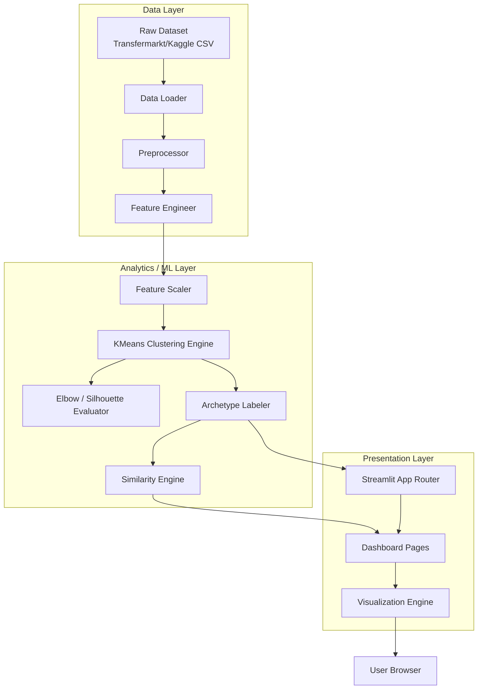

---

## 5. System Context Diagram

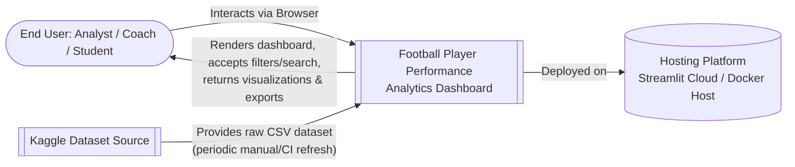

**Narrative:** The System sits between an external, periodically-refreshed data source (Kaggle) and end users who interact exclusively through a browser-rendered Streamlit interface. There are no other external system integrations in the current release (no live APIs, no authentication provider, no third-party analytics), keeping the system boundary intentionally narrow.

---

## 6. Container Diagram

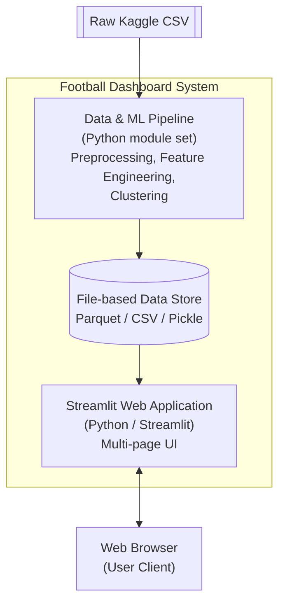

**Container Descriptions:**

| Container | Technology | Responsibility |
|---|---|---|
| Data & ML Pipeline | Python (Pandas, Scikit-learn) | Batch transformation of raw data into a clustered, analysis-ready dataset |
| File-based Data Store | Parquet, CSV, Pickle | Persists intermediate and processed datasets, and serialized ML model artifacts |
| Streamlit Web Application | Python (Streamlit, Plotly) | Serves the interactive multi-page dashboard to end users |

---

## 7. Component Diagram

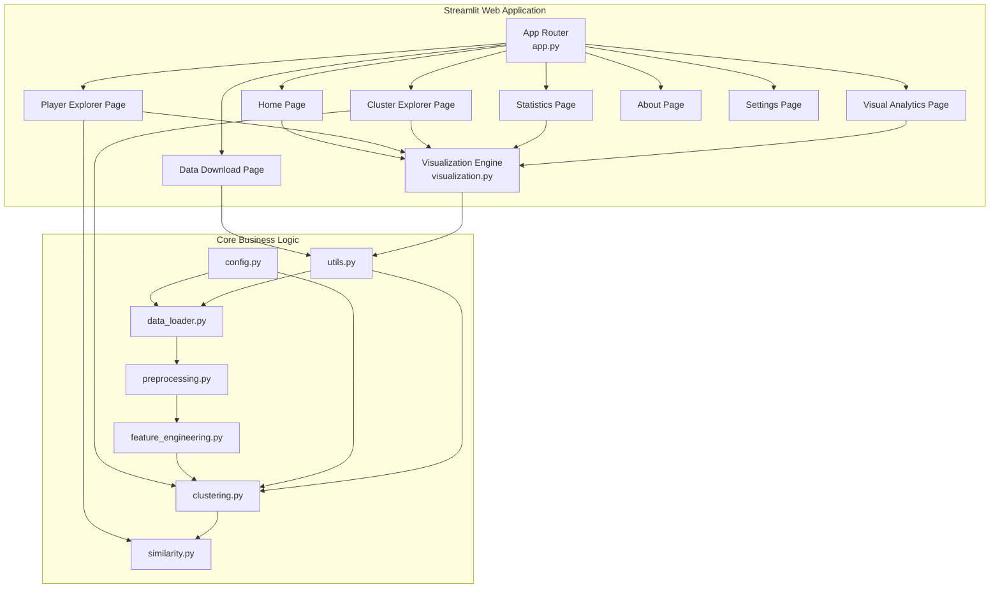

---

## 8. Module Diagram

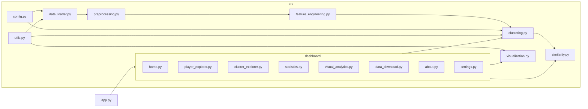

---

## 9. Sequence Diagram

### 9.1 Sequence: Player Search and Comparison

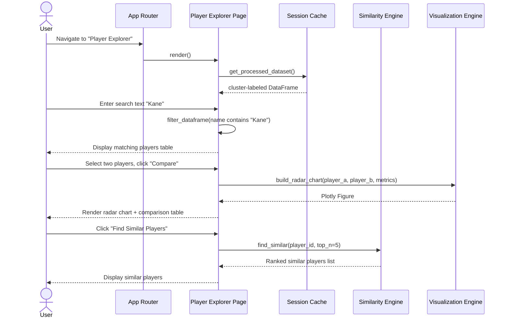

### 9.2 Sequence: Data Pipeline Execution (Startup / Cache Miss)

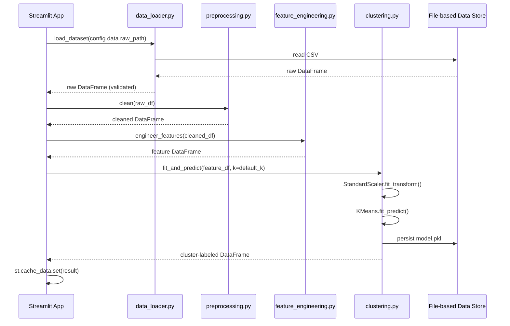

---

## 10. Activity Diagram

### 10.1 Activity: End-to-End Data Processing

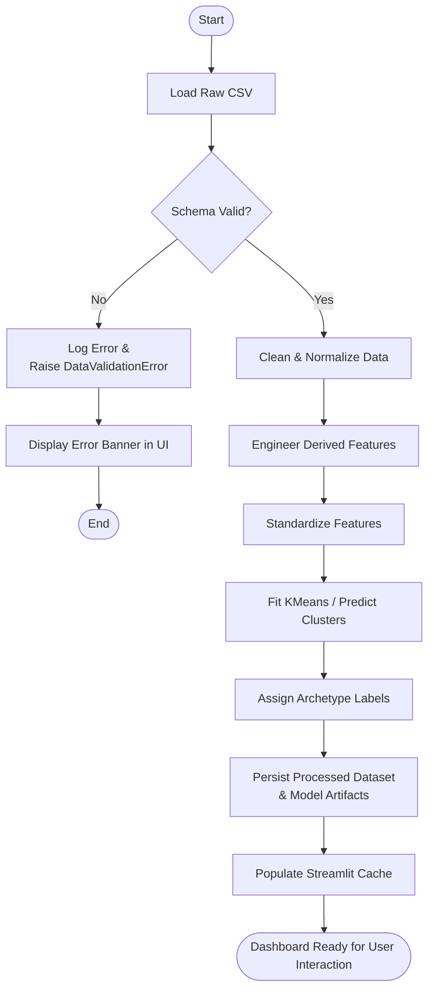

---

## 11. Data Flow Diagram

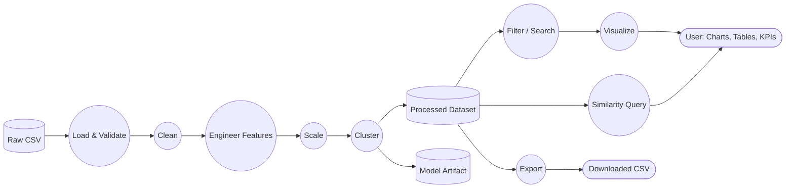

---

## 12. Class Diagram

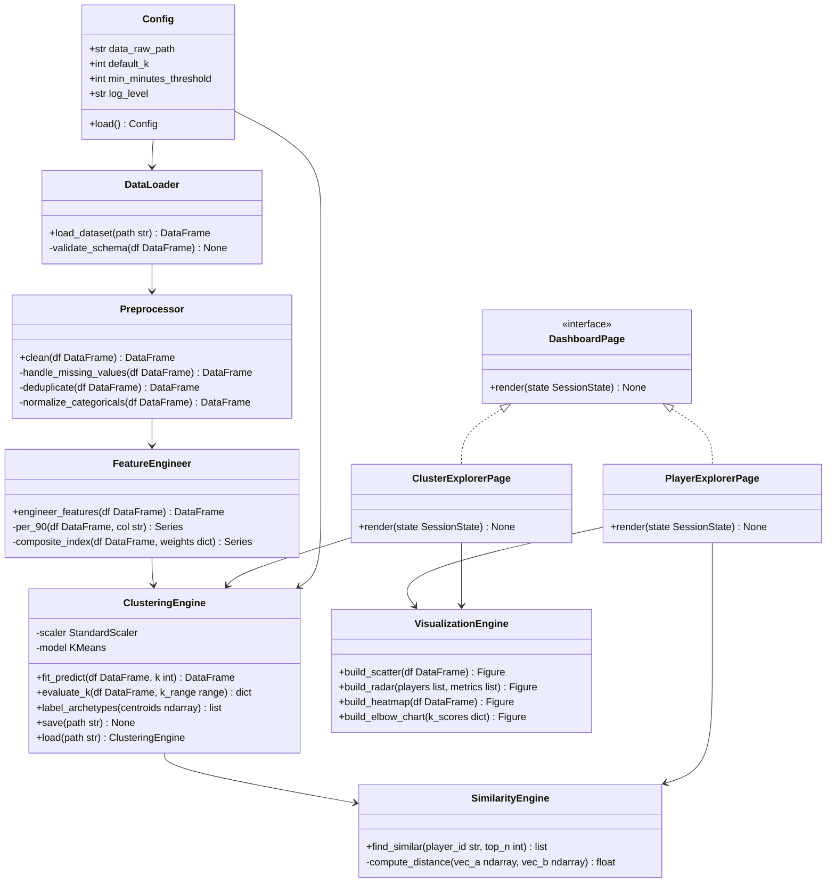

---

## 13. Deployment Diagram

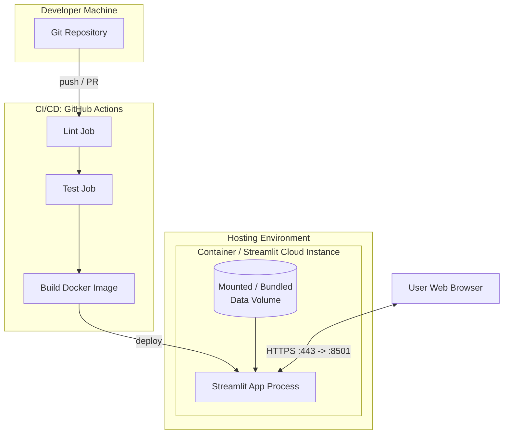

**Deployment Notes:** The application is packaged as a single container image containing the Python runtime, application code, and (optionally) a pre-processed data snapshot baked into the image or mounted as a volume. Streamlit listens on port 8501 internally, fronted by the hosting platform's HTTPS termination (Streamlit Community Cloud) or a reverse proxy/load balancer (self-hosted container deployment).

---

## 14. State Diagram

### 14.1 State: Dashboard Session Lifecycle

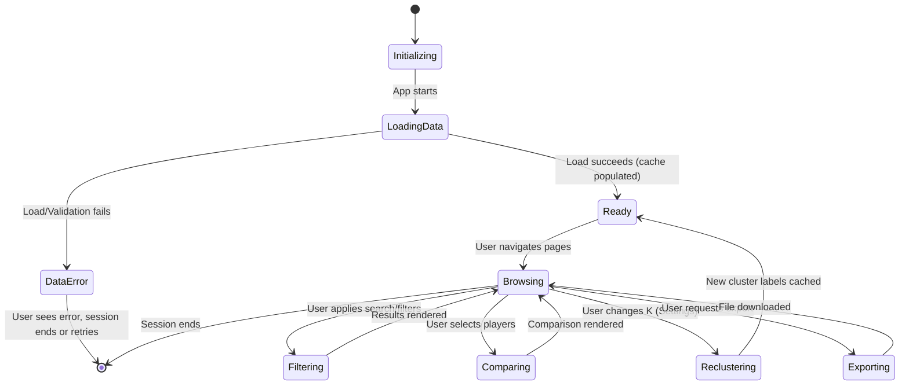

---

## 15. Package Diagram

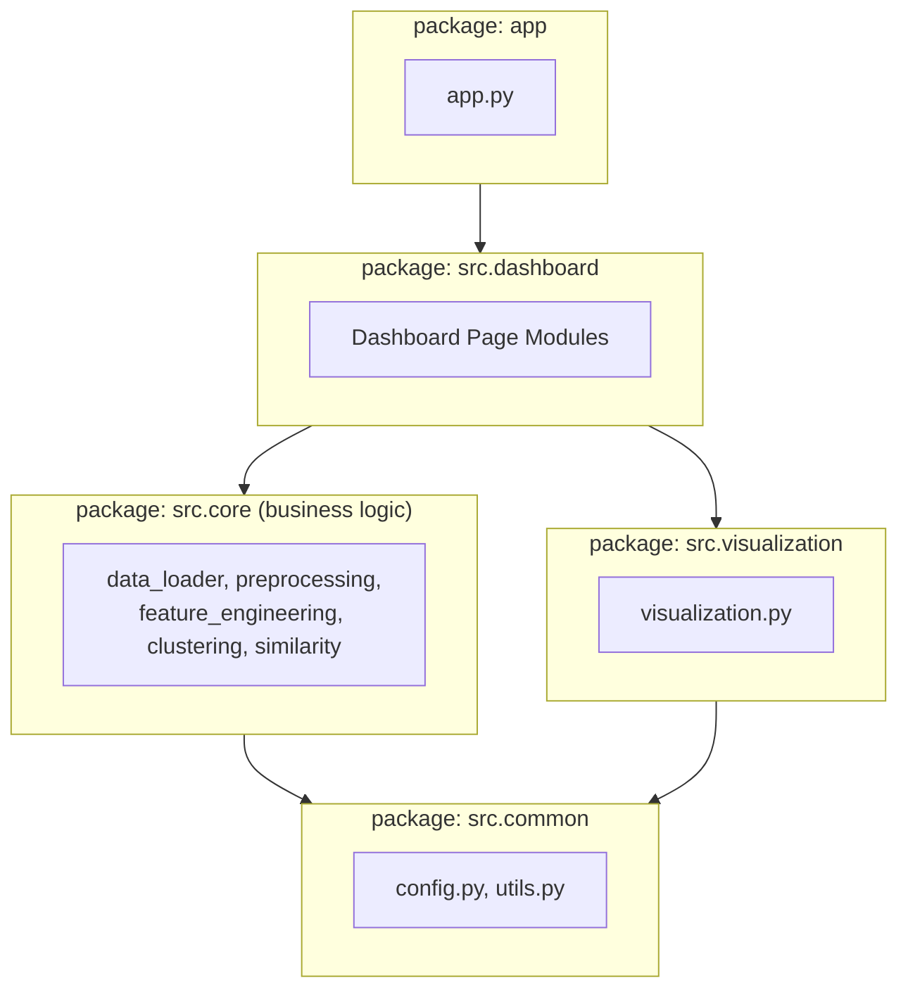

**Dependency Rule:** Packages depend only "inward" toward `src.common`; `src.core` has no dependency on `src.dashboard` or Streamlit itself, which is what makes the business logic independently unit-testable (see TRD Section 18, Testing Strategy).

---

## 16. Layered Architecture

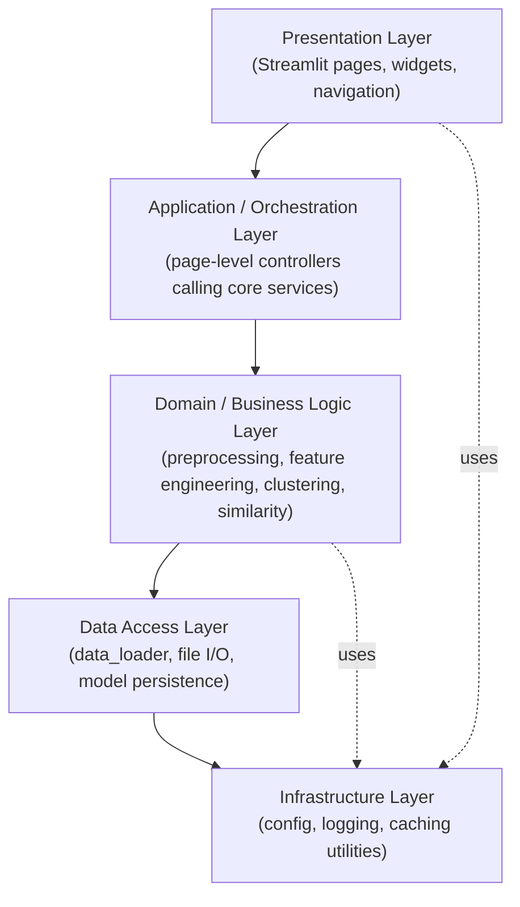

| Layer | Responsibility | Example Modules |
|---|---|---|
| Presentation | Render UI, capture user input | `dashboard/*.py`, `app.py` |
| Application/Orchestration | Coordinate calls to domain services per page action | Page-level render functions |
| Domain/Business Logic | Core analytics/ML rules, independent of UI framework | `preprocessing.py`, `feature_engineering.py`, `clustering.py`, `similarity.py` |
| Data Access | Read/write raw, interim, processed data, and model artifacts | `data_loader.py`, model save/load routines |
| Infrastructure | Cross-cutting concerns | `config.py`, `utils.py`, logging setup |

---

## 17. MVC / MVVM Discussion

Streamlit does not natively enforce an MVC/MVVM pattern, as it re-executes the script top-to-bottom on each interaction and blends view and controller concerns within page functions. The System approximates a pragmatic **Model-View-Controller-like separation**:

- **Model:** `src/` core business-logic modules (`preprocessing.py`, `feature_engineering.py`, `clustering.py`, `similarity.py`) plus the processed `DataFrame`/model artifacts — entirely independent of Streamlit.
- **View:** Widget composition and layout code within `dashboard/*.py` (calls to `st.dataframe`, `st.plotly_chart`, `st.selectbox`, etc.).
- **Controller:** The thin orchestration logic within each page's `render()` function that interprets `st.session_state` and user widget events, invokes Model functions, and passes results to View rendering calls.

This separation is enforced by convention and code review rather than framework mechanics, and is validated by the constraint that all Model modules must be importable and testable without importing Streamlit.

---

## 18. Architectural Decisions

### ADR-01: Modular Monolith over Microservices
**Decision:** Implement as a single deployable modular Python application.
**Rationale:** The workload is single-tenant, batch-oriented, and does not require independent scaling of components. Microservices would add operational overhead disproportionate to project scale.
**Status:** Accepted.

### ADR-02: File-based Storage over Relational Database
**Decision:** Use Parquet/CSV/Pickle file storage rather than a database engine.
**Rationale:** Read-heavy, single-writer batch pipeline; no concurrent transactional writes; minimizes infrastructure dependencies for a portfolio/academic deployment target.
**Status:** Accepted; revisit if multi-user persistence (watchlists, accounts) is introduced.

### ADR-03: K-Means as Primary Clustering Algorithm
**Decision:** Use K-Means as the primary unsupervised clustering method, with Elbow Method and Silhouette Score for K selection.
**Rationale:** K-Means is computationally efficient, well-understood, and produces interpretable centroid-based archetypes suitable for the target audience. Alternative algorithms (DBSCAN, Gaussian Mixture Models) are noted as future enhancements where cluster shapes are non-spherical or density-based grouping is desired.
**Status:** Accepted.

### ADR-04: Streamlit over Custom Web Framework
**Decision:** Use Streamlit rather than a custom Flask/React application.
**Rationale:** Streamlit enables rapid development of data-centric interactive dashboards with minimal front-end engineering overhead, aligning with project scope and timeline.
**Status:** Accepted; trade-off is reduced UI customization flexibility relative to a bespoke front end.

### ADR-05: Exclude Market Value from Clustering Feature Set
**Decision:** Clustering features are restricted to on-pitch performance metrics; market value and wage are excluded from the feature set used for K-Means.
**Rationale:** Including market value would bias clusters toward "expensive vs. cheap" rather than "playing style," undermining the System's core value proposition of style-based archetype discovery.
**Status:** Accepted.

---

## 19. Design Patterns Used

| Pattern | Application |
|---|---|
| **Pipeline Pattern** | Sequential data transformation stages (load → clean → engineer → scale → cluster) |
| **Repository Pattern (lightweight)** | `data_loader.py` abstracts the source of data, enabling future substitution (e.g., database or API source) without changing downstream modules |
| **Strategy Pattern** | Archetype-labeling heuristics and missing-value imputation strategies are configurable per feature/column |
| **Facade Pattern** | `visualization.py` provides a simplified interface over Plotly/Matplotlib/Seaborn for dashboard pages |
| **Singleton-like Caching** | `st.cache_resource` ensures a single fitted clustering model instance is reused across a session |
| **Template Method (implicit)** | Each `dashboard/*.py` page follows a consistent `render(state)` structure |

---

## 20. Scalability Considerations

- **Vertical scaling** (increased host memory/CPU) is the primary scaling lever for the current file-based, in-memory Pandas architecture.
- For datasets significantly larger than tens of thousands of rows, migration to a columnar analytical engine (e.g., DuckDB or Polars) is recommended to avoid full in-memory Pandas materialization on every session.
- The layered architecture (Section 16) permits horizontal decomposition into services (e.g., a separate clustering microservice) in the future without rewriting domain logic, since domain modules have no direct dependency on the Streamlit process.
- Caching (`st.cache_data`, `st.cache_resource`) reduces repeated computation load as concurrent user sessions increase.

---

## 21. Maintainability Considerations

- Strict module boundaries and the dependency rule in Section 15 (Package Diagram) prevent circular dependencies and keep business logic UI-agnostic.
- Consistent docstring conventions (NFR-10 in the SRD) and type hints improve onboarding and IDE tooling support.
- A dedicated `tests/` suite mirroring `src/` structure ensures regressions are caught early (see TRD Section 18).
- Configuration externalization (Section 15, TRD) avoids scattering "magic numbers" (e.g., default K, minimum minutes threshold) throughout the codebase.

---

## 22. Security Architecture

- The System operates on public, non-sensitive statistical data; no PII is processed (see SRD FR-25, NFR-06/07).
- Export sanitization mitigates CSV formula injection (TRD Section 20).
- No arbitrary code execution paths are exposed to end users; all filtering and querying use parameterized Pandas operations.
- Dependency vulnerability scanning is integrated into CI (TRD Section 20).
- Since there is no authentication layer in the current release, the System assumes a trusted, read-only, single-tenant deployment; introducing multi-user accounts in the future (SRD Section 21, Future Enhancements) would require a dedicated identity/authorization architecture, out of scope for this release.

---

## 23. Error Handling Architecture

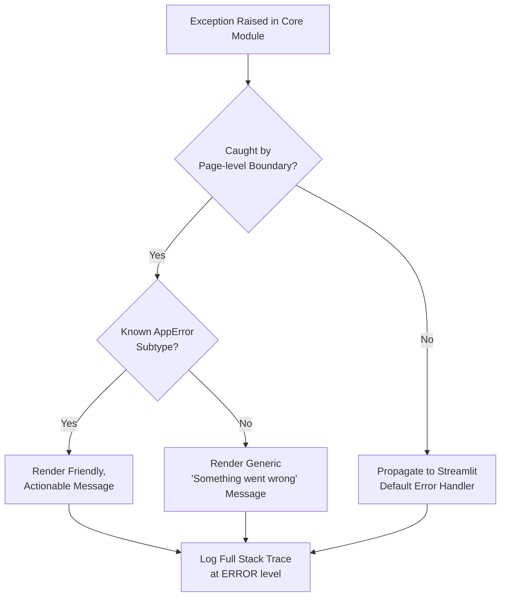

All custom exceptions inherit from a common `AppError` base class (see TRD Section 17), enabling a single `try/except AppError` boundary within each page's `render()` function. This ensures users never see raw Python tracebacks, satisfying NFR-04 (Reliability) and FR-21 (Error Handling) from the SRD.

---

## 24. Performance Architecture

- **Cache-first data access:** All page render functions retrieve data via cached accessor functions rather than re-reading files or re-running the pipeline.
- **Vectorized transformations:** No row-wise Python iteration in the hot path of preprocessing or feature engineering.
- **Lazy computation:** Visualizations are computed only for the currently active page, not pre-rendered for all pages on every rerun.
- **Bounded result rendering:** Tables are paginated to avoid rendering excessively large DOM structures in the browser.
- **Model reuse:** The fitted KMeans model and scaler are cached as a resource, avoiding repeated fitting on every user interaction (fitting only occurs on initial load or explicit K change).

---

## 25. Future Expansion Architecture

Should the System's scope grow (e.g., multi-league support, predictive modeling, user accounts, or real-time data), the following expansion path is architecturally supported by the current layered, modular design:

```mermaid
flowchart LR
    subgraph "Current Architecture"
        Mono[Modular Monolith\nData + ML + Presentation]
    end

    subgraph "Potential Future Architecture"
        API[Analytics API Service\n(FastAPI)]
        MLSvc[ML/Clustering Service]
        DB[(Managed Database\nPostgreSQL)]
        Auth[Auth Service]
        FE2[Front End\n(Streamlit or React SPA)]
    end

    Mono -.evolves into.-> API
    Mono -.evolves into.-> MLSvc
    API --> DB
    MLSvc --> DB
    Auth --> API
    FE2 --> API
```

Because domain logic (`src/core`) has no dependency on the Streamlit presentation layer (enforced by the Package Diagram's dependency rule), extracting `clustering.py` and `similarity.py` into an independent service, or replacing the Streamlit front end with a different client, would require changes only at the integration boundary, not within the domain logic itself.

---

*End of Software Architecture Document.*
